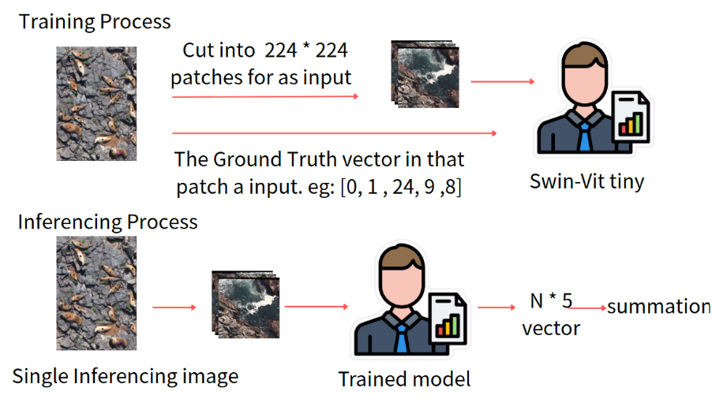
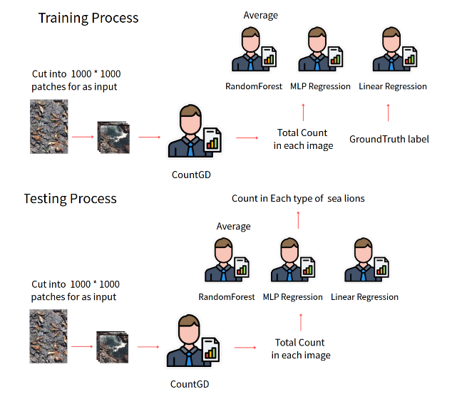
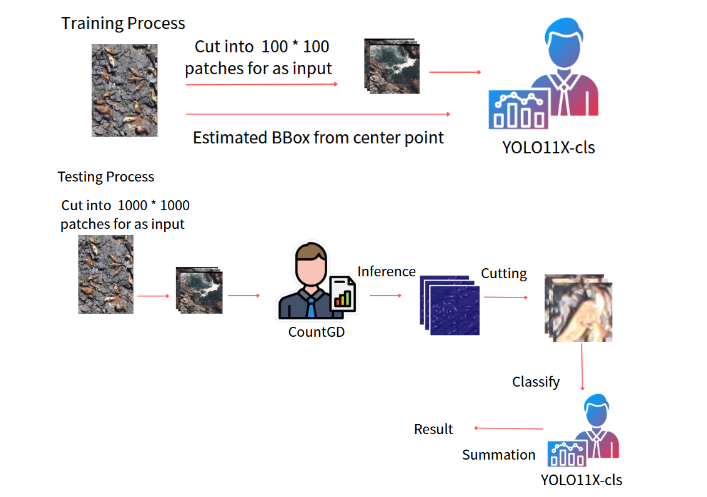
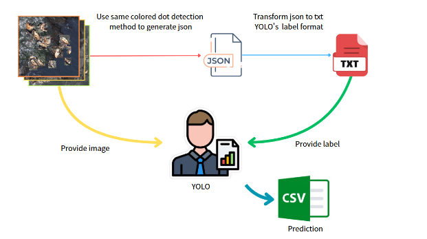

# Deep Learning-based Visual Recognition Final Project

## Team Members
- 110612117 Chung-Yu Chang 
- 110652032 Yuan-Jui Hsu 
- 110550128 Yao-Ting Tsai
- 109612019 Bo-Wei Lin

## Project Overview
In this project, we aim to achieve better performance in the kaggle competition

link: https://www.kaggle.com/competitions/noaa-fisheries-steller-sea-lion-population-count/discussion/35422

This is a counting task, we need to predict the number of sea lions in the image.

We tried to use 4 kinds of ways to solve this problem:

1. Swin Transformer + MLP Regression



2. Counting model + Voting (MLP Regression + Random Forest + Linear Regression)



3. Counting + Vision Transformer / YOLO



4. Pure YOLO detection



## Setup Instructions
### Step 1: Clone the Repository
### Step 2: Create Conda Environment
Create the required environment using the provided `environment.yml` file:
```bash
conda env create -f environment.yml
conda activate promptir
```

### Step 3: Download Dataset
Please download the dataset from:
https://www.kaggle.com/competitions/noaa-fisheries-steller-sea-lion-population-count/discussion/35422

### Step 4: Dataset Configuration
Ensure your project directory structure is as follows:
```
project_root/
├── code/
│   ├── YOLO_detection/
│   ├── YOLO_classification/
│   ├── util/
│   ├── swin_regression/
│   ├── net/
│   └── counting/
├── data/
├── environment.yml
└── README.md
```
### Step 5: Run the Training / Testing Code in the `code` folder


  
